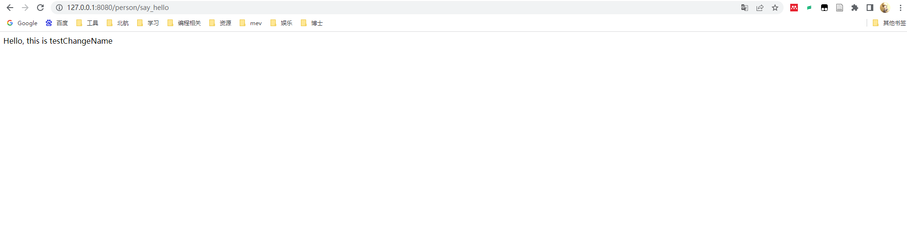

# 使用 Java Spring 提供 restful 服务

参考：https://blog.csdn.net/u012882730/article/details/98871374

## 1. 创建 Spring 环境

* 启动 IDEA , New Project ，使用 Spring Initializer，初始化 Spring 环境：

  
* 在依赖中勾选 Spring Web
  
* 创建完成后，构建工程，并启动，控制台打印出 spring 的初始化过程，由于 Spring 中内嵌了 Apache Tomcat 服务器，因此可以不必单独部署 Tomcat

  
* 打开浏览器 [http://127.0.0.1:8080](http://127.0.0.1:8080/) 默认 Spring 显示一个路径错误页面，至此， Spring 搭建成功。

  

## 2. 创建资源表示形式类

创建如下 Person 类：

```java
package com.example.hw2;

public class Person {
    String name;
    int age;
    boolean gender;

    public Person(String name, int age, boolean gender) {
        this.name = name;
        this.age = age;
        this.gender = gender;
    }

    public void setName(String name) {
        this.name = name;
    }

    public String getName() {
        return name;
    }

    public void setAge(int age) {
        this.age = age;
    }

    public int getAge() {
        return age;
    }

    public void setGender(boolean gender) {
        this.gender = gender;
    }

    public boolean getGender() {
        return gender;
    }

    public String sayHello()
    {
        return ("Hello world! " + this.name);
    }
}
```

## 3.创建资源控制器

创建 `PersonCtr`类

```java
package com.example.hw2;

import org.springframework.web.bind.annotation.*;

@RestController
public class PersonCtr {
    Person person;
    @GetMapping("/person")
    public Person personBasic(
            @RequestParam(value = "name", defaultValue = "wang jinghao")
            String name,
            @RequestParam(value = "age", defaultValue = "18")
            int age,
            @RequestParam(value = "gender", defaultValue = "1")
            boolean gender){
        person = new Person(name, age, gender);
        return person;
    }

    @GetMapping("/person/say_hello")
    public String sayHello() {
        return "Hello, this is " + person.name + "\n";
    }

    @RequestMapping(value = "/person/age/set", method = RequestMethod.POST)
    public boolean setAge(
            @RequestParam(value = "age")
            String age) {
        person.setAge(Integer.parseInt(age));
        return true;
    }


    @RequestMapping(value = "/person/gender/set", method = RequestMethod.POST)
    public boolean setGender(
            @RequestParam(value = "gender")
            String gender) {
        person.setGender(Boolean.parseBoolean(gender));
        return true;
    }

    @RequestMapping(value = "/person/name/set", method = RequestMethod.POST)
    public boolean setName(
            @RequestParam(value = "name")
            String name) {
        person.setName(name);
        return true;
    }
}


```

使用 `@GetMapping `修饰器，为 `personBasic`方法注册路由。`personBasic`方法接受三个参数，

使用 `@RequestParam`，从客户端的请求中读取参数，并设置默认参数值。

之后，使用客户端传入的参数，构造一个新的 Person 对象，并将该对象返回。

类似的，构建 `sayHello `方法，以及修改属性的 `setAge`、`setGender`、`setName `方法。

## 4. 完成 Restful 调用

在浏览器中，对 url：`http://127.0.0.1:8080/person` 进行调用，可以看到直接返回默认的 Person 对象

    

传入 name、age、gender 参数，构建自定义的 Person 对象

在这里，我将用户名从 `wang jinghao`修改为 `testChangeName`

    

调用 ` http://127.0.0.1:8080/person/say_hello` ，显示 sayHello 方法的返回值

    

如图所示，最终成功修改了名称
